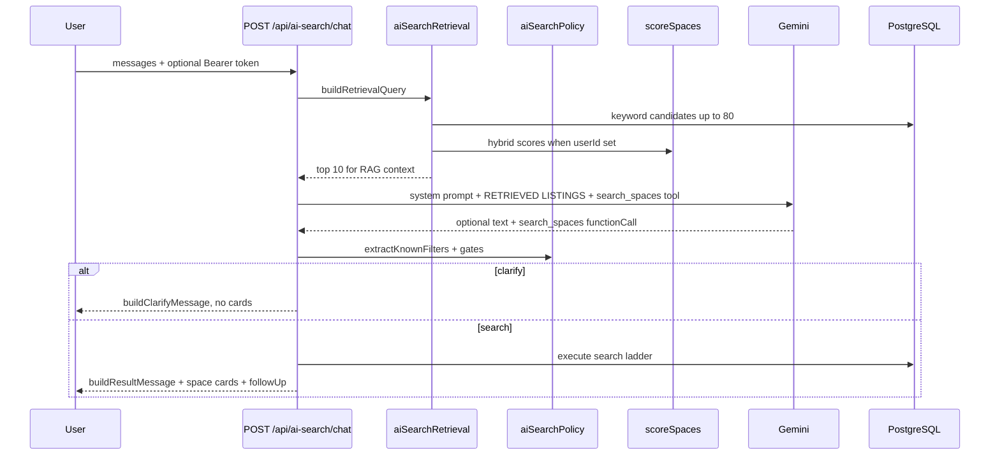

# AI search: RAG (Retrieval-Augmented Generation)

## What RAG means here

**RAG = Retrieve → Augment → Generate**

1. **Retrieve** — query PostgreSQL for listings that match the user's conversation (keyword match + hybrid recommender blend).
2. **Augment** — inject those listings into the Gemini system prompt as `RETRIEVED LISTINGS`.
3. **Generate** — Gemini replies grounded in real data, then calls the `search_spaces` tool for structured search and space cards.



## Personalization blend

For each candidate space:

```
retrievalScore =
  relevanceWeight * normalize(relevance) +
  hybridWeight * normalize(hybrid) +
  popWeight * normalize(pop30d) +
  rawPop30d * 1e-6   // tie-breaker when counts differ
```

| Audience | relevance | hybrid | pop (30d) |
|----------|-----------|--------|-----------|
| Logged out | 0.45 | 0.35 | 0.20 |
| Logged in | 0.35 | 0.45 | 0.20 |

All weights are env-configurable (`RAG_*_WEIGHT`).

| Signal | Source |
|--------|--------|
| Relevance | Keyword hits in title (+3), category/location (+2), description (+1) |
| Hybrid | Existing [`scoreSpaces()`](../src/lib/recommendations.js) — pop30d, content, collab, location |
| Popularity | Confirmed bookings in the last 30 days (explicit weight + tie-breaker) |

Logged-out users use cold-start hybrid (pop + location). Logged-in users with booking/favorite history get full hybrid scores with a higher hybrid weight.

## Space card ordering

The `search_spaces` tool triggers a DB fetch of up to **30** candidates, then **re-sorts** the displayed cards (top **6**) to match RAG retrieval rank — not `createdAt`. This keeps popular and personalized listings at the top of the chat UI.

## Auth

`POST /api/ai-search/chat` uses `optionalAuthMiddleware`. The frontend already sends `Authorization: Bearer` via [`client.ts`](../../frontend/src/app/api/client.ts); no UI change required.

## Structured search (Phase B)

Gemini function calling replaces the legacy `<<<SEARCH{...}>>>` regex pipeline.

| Layer | Responsibility |
|-------|----------------|
| [`aiSearchTools.js`](../src/lib/aiSearchTools.js) | `search_spaces` JSON schema, `parseSearchToolCall`, `normalizeToolArgs` |
| Gemini | Proposes search parameters via `search_spaces` when location + category are known |
| [`aiSearchPolicy.js`](../src/lib/aiSearchPolicy.js) | **Authoritative** gates, filter sanitization, message templates, follow-up |
| [`ai-search.js`](../src/routes/ai-search.js) | RAG injection, tool config, search ladder execution |

**Single-turn tool use:** the API does not send a `FunctionResponse` back to Gemini. Tool args are extracted and the DB search runs in the same HTTP request (same pattern as the old regex parse).

**Tool fallback:** if Gemini omits `search_spaces` but policy detects enough info, the API builds minimal params (`location` + `category`) via `buildFallbackSearchParams` and runs the search ladder anyway.

Tool args are proposals only — `extractKnownFilters` and `buildSearchParamsForLadder` override location, category, date, and amenities from **user text** when the model invents values.

## Conversation policy

Enforced via [`aiSearchPolicy.js`](../src/lib/aiSearchPolicy.js) (backend) plus system-prompt guidance. Function calling replaces parameter **extraction**; policy logic remains backend-owned.

### Enough for cards

User must provide **location** (city, region, or country) **and** **category** (explicit or inferred from project intent). If not, the API returns `resultType: "clarify"` with no space cards.

Phrases like **"anywhere"** or **"any city"** do **not** count as a location. The backend never infers location from RAG retrieval rows, and it ignores Gemini `location` values the user did not mention in their messages.

Regional scope (e.g. `"anywhere in Dolj"`, `"Romania"`) still triggers a **specific city** follow-up after cards.

### Filter inference (price, date, category)

[`aiSearchFilterInference.js`](../src/lib/aiSearchFilterInference.js) parses user phrases; [`aiSearchPolicy.js`](../src/lib/aiSearchPolicy.js) merges them with `search_spaces` tool args (text first, tool fallback).

**Price** — inferred from phrases like `max 50 per hour`, `50 an hour`, `50 bucks`, `under $80`, `50/hr`, `between 20 and 80`, `budget 100`, `€50`. Default currency symbols (`$`, `€`) or bare hourly amounts; no lei/RON. The **most recent user message that mentions price** sets the full price range (it replaces earlier bounds; min and max are not merged across turns).

**Size** — inferred from phrases like `3 sqm`, `3 square meters`, `at least 3 sqm`, `max 50 sqm`, `between 20 and 40 sqm`. Bare `N sqm` means **minimum** size (`minSquareMeters`), not maximum. Same **latest-turn-wins** rule as price when the user refines size in a follow-up message.

**Date** — layered parser using server reference date (same “today” as the Gemini prompt): ISO (`YYYY-MM-DD`), EU numeric (`DD/MM/YYYY`, `DD.MM.YYYY`), named (`June 15`, `15th of June`), ordinals (`on 15th`, `the 15th`), relative (`today`, `tomorrow`, `next Monday`, `this weekend`), and weekdays (`on tuesday`, bare `tuesday`). Newest user turn wins. Gemini-invented dates are stripped when the user never mentioned a date. When the latest message fully restates category **and** location without a date (and no earlier turn was a partial clarify with a date), stale dates from earlier turns are cleared. Dates are **kept** when completing clarify flows (e.g. `anywhere in dolj tomorrow` → `i want to paint`, or `on monday` → `art studio in dolj`).

**Location + date in one message** — date/weekday tails are stripped from inferred locations (`Craiova on tuesday` → `Craiova`; `anywhere in dolj tomorrow` → `Dolj` + date tomorrow).

**Availability when date is set** — AI search uses `searchSpacesWithDateAvailability` (not a plain listing query). A space is shown only if it has at least one bookable slot that day: host banned weekdays, blocked date ranges, existing bookings, and operating-hour windows are all applied. The close-match ladder never relaxes date.

**Category** — two pattern tables in [`aiSearchPolicy.js`](../src/lib/aiSearchPolicy.js), checked in order before word aliases:

- **`CATEGORY_ACTIVITY_PATTERNS`** — activity verbs and project intent (e.g. `cook` → Kitchen Studio, `shoot photos` / `make photos` → Photo Studio, `make pasta` → Kitchen Studio, `make music` → Recording Studio, `pilates` / `gym` → Sports Space, `programmer` → IT Classroom). Word-boundary regex only.
- **`CATEGORY_INTENT_PHRASES`** — venue and compound phrases (e.g. `photoshoot`, `voice over`, `kitchen studio`, `dance rehearsal`).

**Ambiguous verbs:** bare `rehearse` (without dance context) does **not** infer a category — the user is asked what type of space they need. Dance-specific phrasing (`rehearse a dance`, `dance rehearsal`) maps to Dancing Studio.

Multi-turn: category from an earlier user message is kept when a later turn only refines location, price, date, or amenities (`resolveCategoryFromMessages` walks newest-first). Single-word aliases that false-positive in normal speech (e.g. `it`, bare `class`) are avoided.

**Location (diacritics + segment matching)** — user-facing `location` is stored for display; search uses `location_norm` (folded lowercase copy via [`textNormalize.js`](../src/lib/textNormalize.js)). Structured filters (AI search, browse `?location=`, geo text fallback) use **segment-exact** matching on comma-separated place parts — e.g. `roma` does not false-match `Craiova, Romania`; `romania` still matches country segment. Diacritic folding unchanged (`bailesti` ↔ `Băilești`). Autocomplete `GET /locations?q=` uses prefix mode on the same column; free-text `q` search keeps substring `contains` for discovery. Policy trust checks (`userMentionedLocation`) use the same segment logic. Dual-write on space create/update; backfill via `npm run db:backfill-location-norm`.

**Amenities** — [`AMENITY_ID_TO_LABELS`](../src/lib/amenities.js) has **one label per id**, matching frontend `AmenitiesList` (host UI). AI phrase patterns use three tiers: (1) those catalog labels, (2) `AMENITY_EXTRA_PHRASES` colloquial synonyms (e.g. `sound isolation` → `sound`), (3) safe id tokens + label keywords (`AMENITY_ID_TOKEN_BLOCKLIST` for `light`, `sound`). `AMENITY_LEGACY_LABEL_ALIASES` resolves old stored label strings on read only — not used for AI inference. “Track lighting” does not map to an amenity unless the user says “art easels” or similar. Strict cards validated in `cardsSatisfyKnownFilters`. To add an amenity: add to UI `AmenitiesList`, catalog, and optional extras.

### Enough for no follow-up

After cards are shown, **no** `followUp` message when the user already gave a **specific city** (including single-word city names like `Craiova`) plus **at least two** refinement filters (date, budget, capacity, size, or amenities).

### Result types

| `resultType` | Meaning |
|--------------|---------|
| `clarify` | Missing location and/or category — no cards |
| `exact` | Strict search (all user filters) returned matches that satisfy inferred price/size/amenity bounds |
| `close` | Same category + location + date (if set); optional filters (amenities, price, capacity, size) relaxed |
| `none` | No matches even after relaxing optional filters — no cards |

Backend-owned message templates replace Gemini prose for `exact`, `close`, and `none` turns.

### API response shape

```json
{
  "message": "Here is what I think you would like:",
  "spaces": [...],
  "followUp": "If you would like to narrow the search down even more...",
  "searchMeta": {
    "resultType": "exact",
    "knownFilters": { "location": "Romania", "category": "Art Studio" },
    "suggestFollowUp": true,
    "missingRefinements": ["specificCity", "date", "budget", "capacity", "size", "amenities"],
    "toolUsed": true
  }
}
```

The frontend renders **message → cards → followUp** in one assistant turn.

## Close-match ladder

When strict search returns zero results, the API relaxes **optional** filters only (amenities → price → capacity → size). **Category**, **location**, and **date availability** (when a date is set) are always preserved.

RAG retrieval still grounds Gemini's prose, but **failed searches no longer return RAG fallback cards**. Irrelevant listings (e.g. Sports Space in Antarctica with no DB matches) return `resultType: "none"` instead.

## Configuration

| Variable | Default | Purpose |
|----------|---------|---------|
| `RAG_RETRIEVAL_LIMIT` | 10 | Listings injected into Gemini context |
| `RAG_CANDIDATE_POOL` | 80 | Max keyword candidates before blend |
| `RAG_RELEVANCE_WEIGHT` | 0.45 | Anonymous relevance weight |
| `RAG_HYBRID_WEIGHT` | 0.35 | Anonymous hybrid weight |
| `RAG_POP_WEIGHT` | 0.20 | Popularity weight (30d bookings) |
| `RAG_PERSONALIZED_RELEVANCE_WEIGHT` | 0.35 | Logged-in relevance weight |
| `RAG_PERSONALIZED_HYBRID_WEIGHT` | 0.45 | Logged-in hybrid weight |
| `AI_SEARCH_POOL_SIZE` | 30 | Candidates fetched before card re-rank |
| `AI_SEARCH_DISPLAY_LIMIT` | 6 | Space cards shown in chat |
| `RAG_FALLBACK_LIMIT` | 3 | (Legacy config; card fallback removed — RAG is context-only) |

## Committee one-liner

> AI search retrieves listings from PostgreSQL, personalizes retrieval with our hybrid recommender, augments Gemini with that context, then executes a typed `search_spaces` tool call validated by backend policy — it is not prompt-only filter guessing.

## Key files

- [`backend/src/lib/aiSearchRetrieval.js`](../src/lib/aiSearchRetrieval.js) — retrieval and blending
- [`backend/src/lib/aiSearchTools.js`](../src/lib/aiSearchTools.js) — Gemini `search_spaces` tool schema and parser
- [`backend/src/lib/aiSearchFilterInference.js`](../src/lib/aiSearchFilterInference.js) — price/date phrase parsing
- [`backend/src/lib/aiSearchPolicy.js`](../src/lib/aiSearchPolicy.js) — conversation gates, templates, follow-up
- [`backend/src/routes/ai-search.js`](../src/routes/ai-search.js) — RAG injection, tool wiring, search ladder
- [`RECOMMENDATIONS.md`](../../RECOMMENDATIONS.md) — hybrid recommender used for the blend

## Out of scope (Phase C)

- pgvector semantic embeddings for retrieval
