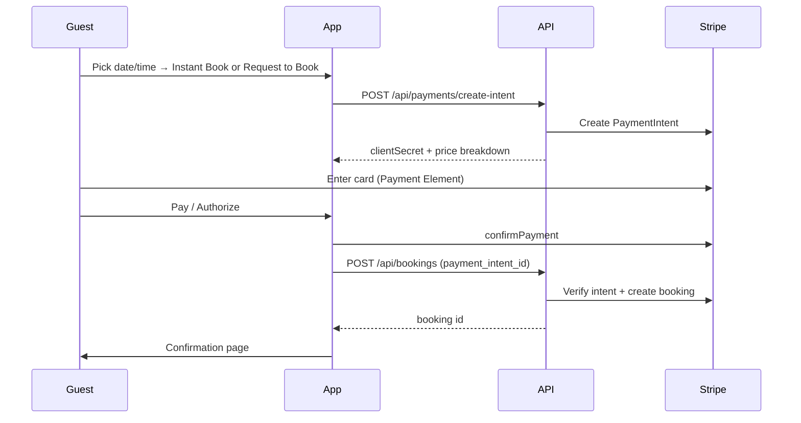

# Billing system

SpaceBook uses **Stripe Payment Intents** in **test mode**. Guests pay on a dedicated checkout page; card data is collected by Stripe’s Payment Element.

## End-to-end flow




**Routes**


| Step           | Frontend                                   | Backend                            |
| -------------- | ------------------------------------------ | ---------------------------------- |
| Space + times  | `SpaceDetails` → `/space/:id/checkout?...` | —                                  |
| Start payment  | `BookingCheckout`                          | `POST /api/payments/create-intent` |
| Pay            | `BookingPayment` (Stripe.js)               | —                                  |
| Create booking | `createBooking()`                          | `POST /api/bookings`               |
| Done           | `/space/:id/confirmation`                  | Notifications                      |


Checkout and confirmation require login (`ProtectedRoute`).

## Instant Book vs Request to Book


|                         | **Instant Book**   | **Request to Book**                      |
| ----------------------- | ------------------ | ---------------------------------------- |
| Button on space page    | Instant Book       | Request to Book                          |
| Checkout title          | Confirm & Pay      | Request to Book                          |
| Stripe `capture_method` | `automatic`        | `manual`                                 |
| On submit               | Charge immediately | Authorize hold only                      |
| Booking status          | `confirmed`        | `pending`                                |
| Host action             | —                  | Confirm → capture; Decline → cancel hold |


Both flows use the same checkout page and the same booking API; only capture timing and initial status differ.

## Pricing

Totals are computed server-side in `bookingRules.js` and returned in the payment-intent breakdown.

```
subtotal     = hourly rate × duration
service fee  = 12% of subtotal only
total        = subtotal + cleaning fee + equipment fee + service fee
```

Cleaning and equipment fees are stored on the booking; the platform service fee is **not** applied to those line items.

## Payment safety

- **PCI:** Card fields are Stripe-hosted iframes (Payment Element). We pass the logged-in user’s name/email at confirm time; billing fields are hidden in the Element UI.
- **Intent reuse:** Abandoned checkouts resume the same PaymentIntent when the slot matches (avoids duplicate DB rows).
- **Verification:** `POST /api/bookings` checks the PaymentIntent metadata (user, space, date, times, amount) before linking it to a booking.
- **Slot conflicts:** Enforced when the booking row is created (instant) or when the host confirms (request). See `backend/docs/CONCURRENCY.md`.

## After booking


| Event                         | Payment                     |
| ----------------------------- | --------------------------- |
| Host confirms pending request | `capture` authorized amount |
| Host declines pending request | `cancel` PaymentIntent      |
| Guest cancels pending request | `cancel` PaymentIntent      |


Stripe webhooks (`POST /api/webhooks/stripe`) sync PaymentIntent status into the `payment` table.

## Data model

- `**User.stripeCustomerId`** — Stripe customer per user
- `**Payment**` — one row per PaymentIntent (linked to `bookingId` after success)
- `**Booking.serviceFeeCents**` — platform fee at time of booking

## Configuration

**Backend** (`backend/.env`)

```
STRIPE_SECRET_KEY=sk_test_...
STRIPE_WEBHOOK_SECRET=whsec_...
```

**Frontend** (`frontend/.env`)

```
VITE_STRIPE_PUBLISHABLE_KEY=pk_test_...
```

**Local webhooks**

```bash
stripe listen --forward-to localhost:3000/api/webhooks/stripe
```

## Key files


| Area                      | Path                                              |
| ------------------------- | ------------------------------------------------- |
| Fee rules                 | `backend/src/lib/bookingRules.js`                 |
| Payments API              | `backend/src/routes/payments.js`                  |
| Bookings + capture/cancel | `backend/src/routes/bookings.js`                  |
| Stripe helpers            | `backend/src/lib/paymentHelpers.js`               |
| Webhooks                  | `backend/src/routes/webhooks.js`                  |
| Checkout UI               | `frontend/src/app/components/BookingCheckout.tsx` |
| Stripe form               | `frontend/src/app/components/BookingPayment.tsx`  |


