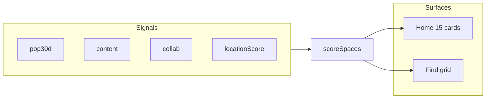

# Hybrid Recommendation System

This document describes the intelligent recommendation component used on the home page and Find a Space grid.

## Architecture



### Ranked search contract (Find grid)

1. Apply SQL filters (category, price, amenities, etc.)
2. Apply geo hard filter (`nearby` or `city`)
3. If date is set, collect **all** available space ids (full batched scan)
4. Score every candidate id
5. Stable sort: `score DESC`, `id ASC`
6. Paginate: hydrate only `slice(offset, offset + limit)`

## Scoring formulas

**Logged in (with booking or favorite history):**

```
finalScore = 0.25*pop30d + 0.30*content + 0.25*collab + 0.20*locationScore
```

**Cold start (logged out or no history):**

```
finalScore = 0.55*pop30d + 0.45*locationScore
```

| Signal | Description |
|--------|-------------|
| `pop30d` | Confirmed bookings in the last 30 days, min-max normalized |
| `content` | Category preference + amenity Jaccard from user bookings and favorites |
| `collab` | Co-booking overlap: users who booked the same spaces also booked this |
| `locationScore` | `max(0, 1 - distance/maxRadius)` from ranking center |

Spaces the user already booked are **not** excluded or down-ranked.

## Geo modes

| Surface | Mode | Hard geo filter | Ranking center |
|---------|------|-----------------|----------------|
| Home | `home_boost` | No | Default city (Craiova) |
| Find (no location) | `nearby` | Yes, 100 km + city text fallback | Craiova |
| Find (location set) | `city` | Yes, geocoder bbox + 10% buffer (fallback: 25 km radius) + city text fallback | Selected city center |

Default center is configured via environment variables (not IP-based).

## API endpoints

| Endpoint | Auth | Description |
|----------|------|-------------|
| `GET /api/spaces/recommended` | Optional | Top 15 personalized spaces for home |
| `GET /api/spaces/featured-this-month` | None | Top 15 cold-start ranked spaces for home |
| `GET /api/spaces?sort=recommended` | Optional | Ranked Find grid search |

Query params for ranked search: `sort=recommended`, `centerLat`, `centerLng`, `placeNorth`, `placeSouth`, `placeEast`, `placeWest`, `location`, plus existing filters.

## Configuration

| Variable | Default | Purpose |
|----------|---------|---------|
| `DEFAULT_CITY_NAME` | `Craiova` | Text fallback for spaces without coordinates |
| `DEFAULT_CITY_LAT` | `44.3191` | Default ranking center latitude |
| `DEFAULT_CITY_LNG` | `23.7936` | Default ranking center longitude |
| `NEARBY_RADIUS_KM` | `100` | Nearby hard filter radius |
| `CITY_FILTER_RADIUS_KM` | `25` | City hard filter fallback when geocoder bbox unavailable |
| `CITY_BBOX_BUFFER_PCT` | `0.10` | Expand place bbox by 10% on each side |
| `HOME_RECOMMENDATION_LIMIT` | `15` | Home section card count |

## Evaluation

Hold-out evaluation script for thesis metrics:

```bash
cd backend
npm run db:evaluate-recommendations
```

Methodology:

- Users with at least 2 confirmed bookings
- Hold out the most recent booking's space
- Train on remaining booking history
- Compare hybrid top-5 vs popularity-only baseline
- Reports precision@5 and recall@5

## AI search (RAG)

Personalized retrieval for the AI assistant reuses `scoreSpaces()` to blend query relevance with hybrid scores before augmenting the Gemini prompt. See [AI_RAG.md](AI_RAG.md).

## Key source files

- [`backend/src/lib/recommendations.js`](backend/src/lib/recommendations.js) — scoring engine
- [`backend/src/lib/rankedSpaceSearch.js`](backend/src/lib/rankedSpaceSearch.js) — full-set ranked search
- [`backend/src/lib/geoSearch.js`](backend/src/lib/geoSearch.js) — haversine and geo filters
- [`backend/prisma/evaluate-recommendations.js`](backend/prisma/evaluate-recommendations.js) — evaluation script
